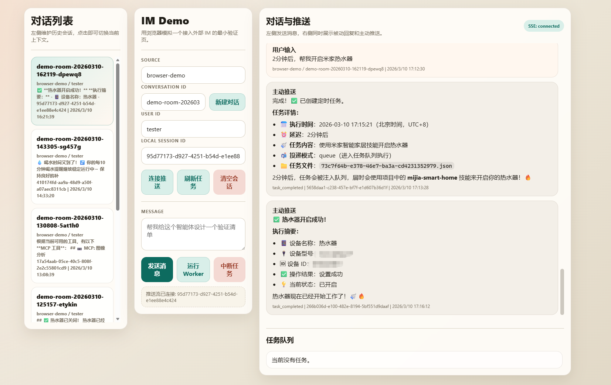

# AgentExtend

AgentExtend 是一个面向本地智能体编排的实验型仓库，当前核心内容位于 [MVP/](MVP/)：一个基于 TypeScript 的最小运行时原型，用来验证“通过 TypeScript SDK 二次封装调用 Claude Code 能力”在会话管理、异步任务队列、定时调度和主动推送场景下的可行性。

## 当前包含内容

- [MVP/](MVP/)：主运行时、HTTP API、会话管理、任务队列、SSE 主动推送、浏览器 IM Demo。
- [MVP/skills/](MVP/skills/)：项目级 skills 示例，运行时会把这些上下文显式暴露给智能体。
- [ScreenShot.png](ScreenShot.png)：浏览器 IM Demo 的界面截图。

## 核心能力

- 基于 [@anthropic-ai/claude-agent-sdk](MVP/package.json) 实现智能体调用，不再依赖 shell 包装 stdin/stdout。
- 支持业务层本地 session 与外部 IM 会话映射，便于对接浏览器 IM、Webhook 或企业 IM 网关。
- 支持按会话隔离的任务队列，worker 顺序消费任务并复用底层 Claude 会话上下文。
- 支持定时任务调度，到期后可选择入队执行或直接主动推送。
- 支持 SSE 推送流和 push 日志，便于把异步结果回传给前端或外部系统。
- 支持浏览器 IM 验证页，可直接验证消息发送、任务执行、定时调度和主动推送链路。

## IM Demo 截图



## 快速开始

前置条件：

- Node.js 18+
- 已完成 Claude Code 登录或具备可用认证状态

在 [MVP/](MVP/) 目录下安装并构建：

```bash
cd MVP
npm install
npm run build
```

启动 HTTP API 与内置 worker：

```bash
cd MVP
npm run start:http
```

然后在浏览器打开：

```text
http://127.0.0.1:3000/im
```

如果只想快速验证 CLI 路径，也可以直接执行：

```bash
cd MVP
npm start -- --task "请用三句话总结当前目录下项目的目标"
```

## 运行时目录

MVP 运行后会在工作目录生成 `.agent-extend/`，用于保存本地运行时状态，主要包括：

- `sessions.json`：本地会话与外部会话映射
- `incoming-messages.json`：异步接收的入站消息
- `queues/*.json`：每个会话的任务队列
- `schedules/sessions/{sessionId}/*.json`：每个会话的定时任务
- `push-events.jsonl`：主动推送事件日志

这些状态文件采用主文件加备份文件写入策略，并结合文件锁与原子 claim 机制，降低并发写入损坏和多 worker 重复抢任务的风险。

## 适用场景

- 本地验证智能体任务编排
- 外部 IM 接入形态验证
- 异步任务队列与主动推送联调
- 定时任务触发与结果回传验证

## 详细文档

- 运行说明、命令列表、HTTP API、定时任务语义：见 [MVP/README.md](MVP/README.md)
- 主要源码入口：见 [MVP/src/](MVP/src/)

如果你是第一次接手这个仓库，建议先阅读 [MVP/README.md](MVP/README.md)，再从 [MVP/src/index.ts](MVP/src/index.ts) 和 [MVP/src/HttpApiServer.ts](MVP/src/HttpApiServer.ts) 进入代码。
